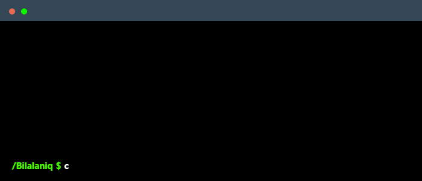

<br>

```
                                                _    ,    _  _     _     _       _
                                               ' )  /    // //    ' )   /       //   / /
                                                /--/ _  // // __   / / /__ __  // __/ /
                                               /  (_</_</_</_(_)  (_(_/(_)/ (_</_(_/_'
                                                                                o
```

<div align="center">
<h2> Hi, I'm Muhammad Bilal </h2>
</div>

<br>

<p>
    I am a passionate <strong>Cybersecurity Enthusiast</strong> currently pursuing a Bachelor of Science in Cybersecurity at Air University, Islamabad, with plans to graduate in 2027. I have a keen interest in understanding the complexities of digital security and strive to develop my skills to protect against cyber threats. Living in Pakistan, I am constantly learning and staying updated on the latest trends and challenges in the cybersecurity field. My goal is to contribute to making the digital world a safer place and further enhance my expertise in this ever-evolving domain.
</p>

  

#### Find Me On

[](https://github.com/bilalaniq)  
[](https://www.linkedin.com/in/muhammad-bilal-b159a5292/)  
[](mailto:bilalaniq2@gmail.com)  
[](https://www.instagram.com/bilalaniq4/)

 &nbsp; **_Skills_**

<div align="left" style="max-width: 50%; overflow-wrap: break-word;">
    
    
    
    
    
    
     
     
     
    
    
    
    
    
    
    
    
    
    

</div>

<br>
<br>


 
<br>
<br>


### 📈 GitHub Stats:

<p align="center">
  
  <br />
  
</p>

<br>
<br>


